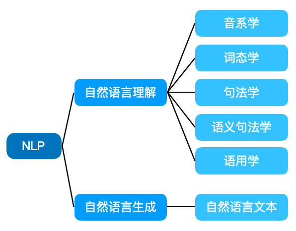

# NLP
## 一、What is NLP?
### NLP的概念
1. NLP （Natural Language Processing）自然语言处理，是人工智能的一个重要方向，就是研究能实现人与计算机之间用自然语言进行有效通信的各种理论和方法。
2. 从自然语言的角度出发，NLP基本可以分成两个部分：
	
- 音系学：指代语言中发音的系统化组织。
- 词态学：研究单词构成以及相互之间的关系。
- 句法学：给定文本的哪部分是语法正确的。
- 语义学：给定文本的含义是什么？
- 语用学：文本的目的是什么？[1]
## 二、NLP面临的实际问题
句子“我们把香蕉给猴子，因为（她们）饿了”和“我们把香蕉给猴子，因为（它们）熟透了”有同样的结论。但是代词“她们”在第一句中指的是“猴子”，在第二句中指的是“香蕉”。如果不了解猴子和香蕉的属性，无法区分。（英文的it没有区分，但在中文里「她」和「它」是有区别的，只是代词在中文里常常被省略，因此需区别属性并且标示出来）

参考文献：
[1] 涂铭, 刘祥, 刘树春. Python自然语言处理实战核心技术与算法[M]. 机械工业出版社, 2018.4