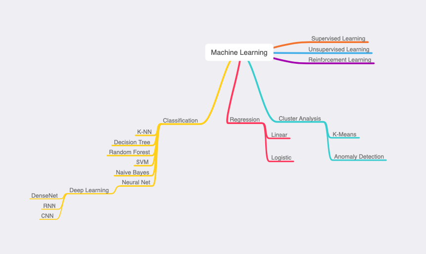

# Teach My Grandpa AI
I think the best way of learning is sharing. So I decide to start up a plan that teach my grandpa AI in an easy understanding way. 
Following is the mind map of the entire learning process.

 

>Machine Learning

>>Supervised Learning 
>>Unsupervised Learning 
>>Reinforcement Learning 

>>>Cluster Analysis
>>>>K-Means 
>>>>Amomaly Detection 

>>>Regression
>>>>Linear 
>>>>Logistic 

>>>Classification
>>>>Neural Net
>>>>>Deep Learning
>>>>>>DenseNet 
>>>>>>CNN 
>>>>>>RNN

>>>>K-NN 
>>>>Decision Tree 
>>>>Random Forest 
>>>>SVM 
>>>>Naive Bayes

